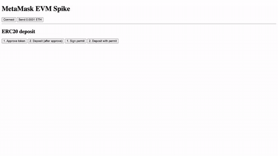

# @wallets-e2e/metamask

`WalletDriver` for the real [MetaMask](https://metamask.io) extension, pinned to the official **13.13.1 production artifact**, for **any EVM network**. Real import, real popups, real transactions. No mocking.


<p align="center">
  
</p>

One uninterrupted session: import → network → connect → send ETH → approve ERC20 → deposit → sign permit → deposit with permit. The GIF is a build artifact of a passing `demo-full-flow.spec.ts` — a failed run writes no GIF.

## Install

```bash
npm install --save-dev @wallets-e2e/core @wallets-e2e/metamask @playwright/test
pnpm build:metamask
```

`@playwright/test` is a peer dependency. `build:metamask` downloads and verifies the pinned extension.

## Fixture wallet

No seed phrase is checked in. Generate one, then fund the address it prints:

```bash
node wallets/metamask/scripts/generate-fixture-wallet.mjs
```

It writes the gitignored `wallets/metamask/.env.local`, which `fixtures/wallet.ts` loads automatically. Don't `source` it in bash — seed phrases contain spaces. Re-running preserves an existing wallet; `--force` replaces it.

## Usage

```ts
import { test, expect } from '@playwright/test';
import { EVM_NETWORKS, launchContext } from '@wallets-e2e/core';
import { metamaskDriver } from '@wallets-e2e/metamask';
import { wallet } from '@wallets-e2e/metamask/fixtures/wallet.js';

test('connects on the selected network', async () => {
  const context = await launchContext({
    extensionPath: 'wallets/metamask/dist',
    userDataDir: '.tmp/metamask-profile',
    recordVideoDir: 'test-results/videos',
  });
  const page = await context.newPage();
  await page.goto('http://127.0.0.1:3456');

  await metamaskDriver.importWallet(context, wallet.seedPhrase);
  await metamaskDriver.switchNetwork?.(context, EVM_NETWORKS.sepolia);

  await metamaskDriver.connectToDapp(context, async () => {
    await page.getByTestId('connect-wallet').click();
  });

  await expect(page.getByTestId('connected-address')).toContainText(wallet.address);
  await context.close();
});
```

Each driver call takes the dapp interaction as a trigger, then handles the popup it produces.

| Call | Approves |
|---|---|
| `importWallet(context, seedPhrase)` | onboarding, SRP, password |
| `switchNetwork(context, network)` | network selection or add-chain |
| `connectToDapp(context, trigger)` | the connect popup |
| `confirmTransaction(context, trigger)` | a transaction |
| `approveTokenPermission(context, trigger, options?)` | an ERC20 allowance, optional `spendLimit` |
| `confirmSignature(context, trigger)` | EIP-712 / EIP-2612 permit |

## Networks

The network is an argument, not the driver's identity. Built-in chains use MetaMask's bundled provider; custom chains and explicit overrides are probed first — chain id must match and `eth_blockNumber`, `eth_gasPrice`, `eth_getBalance`, `eth_estimateGas` must all answer.

Override one chain with `WALLETS_E2E_RPC_URL_<chainId>`, or all with `WALLETS_E2E_EVM_RPC_URL`. For reads and receipts use `createInjectedEvmRpc(page)` so they share MetaMask's active provider.

## More

- [examples/metamask-spike](../../examples/metamask-spike) — Playwright specs, contracts, deploy script
- [examples/metamask-bdd](../../examples/metamask-bdd) — the same flows as Gherkin `.feature` files
- [CONTRIBUTING.md](../../CONTRIBUTING.md) — setup and demo GIF regeneration

## License

MIT
